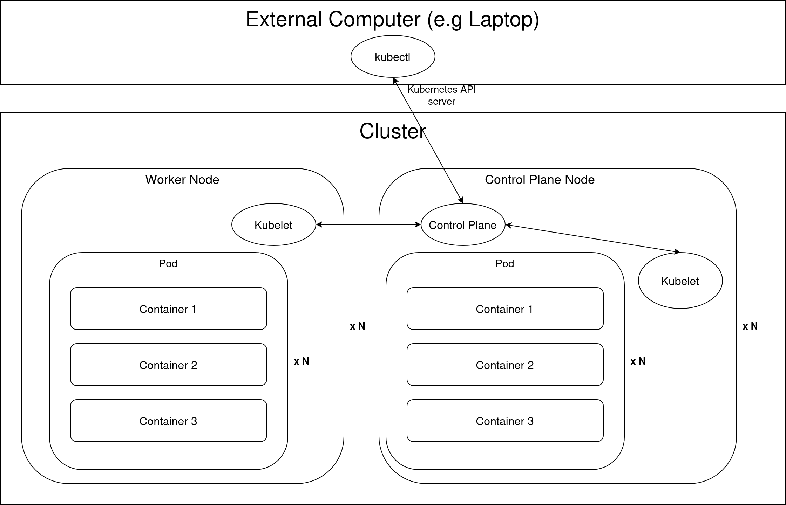
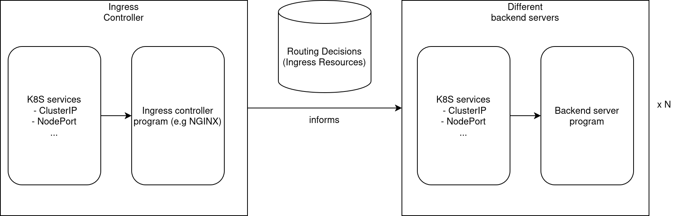

# Core diagram

 * Every runnable job is run inside containers
 * A pod is the "smallest" unit that could be run
    * May contain multiple containers
 * Each node is either a control plane node or a worker node
    * Can be physical machine
    * Or VM
 * Kubelets are services used for fundamental kubernetes operations
    * Deploying containers (e.g with containerd)
 * Control plane instructs kubelets what to do
 * `kubectl` command connects to the control plane through the Kubernetes API server
    * `kubectl` can be installed separately in a user's device (e.g developer's laptop)
    * `kubectl` is bundled inside microk8s installations

# Types of "runnable things"
## Deployments
Programs that are expected to run long-term.
## Jobs
Programs that run in a one-off fashion.
## Cron Jobs
Scheduled programs that run periodically or in some expected time

# Namespaces
To isolate different groups of processes, kubernetes supports namespaces so the resources in namespaces are isolated from each other. This allows resources in different namespaces to have the same names, and allows rules to enforce permissions, limits on taking resources and so on.

A Kubernetes resource can either be cluster-wide (global), or belong to exactly one namespace.

# Network
Recall that in Docker, it is necessary to specify port forwarding in the `docker-compose.yml` file so a specified port in the host will be forwarded to a port inside a specified container. Kubernetes has similar behaviour.

## Services
Services acts as a flag for Kubernetes deployments / pods to declare that they are listening to a port. There are mainly these kinds of services for managing TCP sockets:
  * ClusterIP - Services that are only accessible internally by K8S jobs
    * Doesn't cause physical hosts to listen to any ports indicated by the ClusterIP (intended for internal use only)
    * Still accessible by pods within the cluster, using the ClusterIP address or DNS name.
  * NodePort - Services that make use of a ClusterIP, and makes all nodes listen to the specified port, and forwards to the ClusterIP end point.
    * All physical nodes listen to the specified port, making this service accessible from the outside
    * The destination is the specified ClusterIP, where the ClusterIP specifies the internal load balancing and routing and so on.
  * LoadBalancer - Haven't used this before.

## Ingress
Recall that some setups make use of a [reverse proxy](../encryption.md#encryption-reverse-proxy). A reverse proxy usually reads the HTTP requests and responses and forwards the HTTP requests to the backend servers, or may help upgrade HTTP to HTTPS if the server doesn't natively have TLS/HTTPS capabilities (look up [TLS termination for details](https://en.wikipedia.org/wiki/TLS_termination_proxy)). Unlike services, which operate at the TCP level, this operates at the HTTP level.

Ingresses are the settings for Kubernetes to know which "HTTP services" there are, and correspondingly assign a reverse proxy to forward HTTP requests to the HTTP services. The two main parts of ingresses are:

 * Ingress controller - The program for the reverse proxy (e.g NGINX)
 * Ingress resources - The specifications the configurations of the ingress endpoints
    * What services there are, etc...

Here is the workflow of the Kubernetes ingresses:

Note that the ingress controller is like a usual Kubernetes deployment stack, itself with ClusterIP, NodePort etc configurations. The main point for Kubernetes Ingress stack is to allow to configure HTTP level routing decisions so that the ingress controller is instructed to execute such routing decisions.

The diagram does left to right, so the "incoming" connections start at the Ingress controller's Services. If the ingress controller has only ClusterIP services, and also the backend servers, this will cause the backend servers to be only accessible internally, no matter the Ingress resources configuration. This is because Ingress resources only adjust how the ingress controller routes to the backend servers, but does not dictate at the TCP level whether a port has to be listened to and so on.

# Helm
Kubernetes uses Helm to install "extensions" on kubernetes. Helm is to kubernetes as is pip is to Python. The "packages" are called Helm charts, and the command is `helm/helm3` (or `microk8s helm/helm3`). 

Helm charts usually create a namespace, and then creates particular deployments and so on in the newly created namespaces, so that the extensions for the kubernetes cluster can be managed by kubernetes operations itself, to reap the benefits of distributed computing.

# K8S Accounts
To interact with the Kubernetes API (the API that configures the control plane), there are two types of accounts in K8S.
## User accounts
User accounts are mainly for human operators to interact with the Kubernetes API and configure the settings for the control plane. The user account is mainly used for enabling access through the `kubectl` command, and connecting to the Kubernetes API.

## Service accounts
Service accounts are for internal Kubernetes pods to access the Kubernetes control plane itself. This can be useful as internal K8S programs may need knowledge of the Kubernetes pods they are running on, or for the programs running in pods themselves to schedule other jobs/deployments (e.g Gitlab for CI/CD).

**Assignment to pods** There is always a service account for every namespace. One can create multiple service accounts in a namespace. For each pod in the K8S cluster belonging to a namespace `N1`, there is always a *single* service account assigned to it *in the same namespace*.

**Service account permissions** Service accounts are for pods to access the K8S control plane (K8S API). Their *reach/scope* dictates what kinds of operations the pods can do if they are given a specific service account. The operations a pod can do to the K8S control plane depends on the operations dictated by the configuration of the unique service account that is assigned to it.

## Roles
Roles and ClusterRoles define permissions that can be granted to accounts. K8S initializes different default existing roles that can be used to grant access to operations within the K8S cluster. For example, `cluster-admin` is a global cluster role that grants access to all possible operations for the K8S cluster. A role/clusterrole serves as a "list of operations/resources etc" that can be done. There are two types of roles:

 * Role
   * There is always exactly one namespace that the role belongs to
   * Made to access a list of operations in a specific namespace
 * Cluster role
   * For operations/resources that do not depend on a particular namespace
   * e.g. Nodes, persistent volumes, definition of namespaces etc
   * Global, does not belong to a specific namespace, doesn't have the namespace property

## Bindings
Bindings can bind roles/cluster roles to both User and Service accounts. Here are the two main types of bindings, both of which can specify user or service account(s) to bind the roles to.

 * RoleBinding
   * Can be bound to both Roles or ClusterRoles
   * Belongs to a namespace
   * Bind to role
     * Role must be in the same namespace as the RoleBinding's namespace
     * Grants access to the Role(s) in the particular namespace
     * Accounts can be in different namespace than the RoleBinding's namespace
   * Bind to clusterrole
     * The permissions granted by that cluster role will be restricted to those of the RoleBinding's namespace
     * Non-namespace dependent resources will be dropped (e.g Nodes, namespaces themselves, PersistentVolume)
     * Permissions won't be granted outside the namespace of the RoleBinding (for other namespaces).
 * ClusterRoleBinding
   * Can only be bound to ClusterRoles.
   * The permission is to be granted cluster-wide (not dependent on namespace)
   * Global, does not belong to a specific namespace, doesn't have the namespace property

# Storage
In Kubernetes, the storage options is quite flexible to allow many possibilities.

## Storage class
A storage class is a generic configuration to specify *how a class of persistent information is to be stored*. This gives a definition on how to use a specific storage provider, and its relevant configuration. For instance, a storage class can use a host directory as its storage provider, and the configuration options will be the specific node and the path inside the node. Rook-ceph is another storage provider.

Storage classes are cluster-wide (global).

## Persistent Volume
A persistent volume (PV) is a specific instance (volume) of a storage class, that can be used to be mounted inside containers. Persistent volumes are cluster-wide (global). These are the actual instances that store data, while how the data is stored depends on the configuration by the StorageClass. 

When creating a PV, one must specify an access mode for it (can be assigned with exactly one of the below):
* RWO (ReadWriteOnce) - The volume can be mounted as read-write by a single node
  * Only one node can mount the volume at a time
  * That node can both read from and write to the volume
  * Multiple pods on that same node can access it simultaneously

* ROX (ReadOnlyMany) - The volume can be mounted read-only by many nodes
  * Multiple nodes can mount the volume simultaneously
  * All nodes can only read from it (no writing)
  * Multiple pods across these nodes can read from it simultaneously

* RWX (ReadWriteMany) - The volume can be mounted as read-write by many nodes
  * Multiple nodes can mount the volume simultaneously
  * All these nodes can both read from and write to the volume
  * Multiple pods across these nodes can read/write simultaneously

Once the PV is created, the access mode cannot be changed. The access mode dictate whether at the same time, the number of nodes that can access it, and the operations allowed. For RWO, if multiple pods are placed in the same node, the pods can access the PV at the same time in RW fashion.

## Persistent Volume claim
A persistent volume claim (PVC) is a rule selection for K8S to assign a PV that satisfies the PVC to a pod. The PVC can specify a particular name (using the `volume-name` configuration) to require the pod to bind to a specific PV, or use a set of rules that the PV can specify for more flexibility.

PVCs are namespace specific resources, and pods can only claim PVCs belonging to the same namespace as the pod.

# Commands
`kubectl describe`
`kubectl get`
Commands to list available resources. Both commands are the same, expect that one gives more detailed output and one gives concise output in tabular form.

`kubectl port-forward`
Forwards a port from the physical machine that the `kubectl` command is installed in, to the specified destination `container:port`. Similar to SSH port forwarding, in that when the command is closed, the tunnel will be closed too.

# Notes
Hostnames of kubernetes have to be unique.