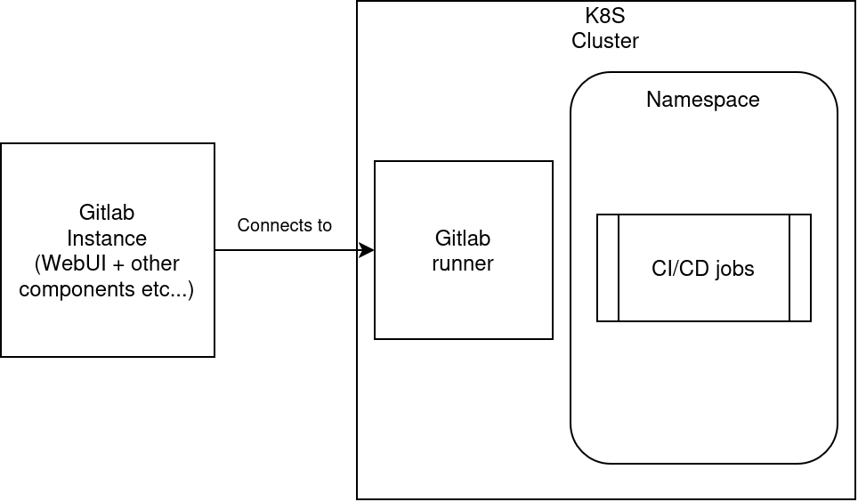

# Gitlab
For the [initial setup](setup.md) that is used for [Gitlab](setup_gitlab.md), please refer to the documents in the links. 

## Gitlab for CI/CD
Gitlab has a WebUI, which works similar to Github and also hosts different Git repos for a list of jobs. To allow Gitlab for CI/CD, here is the usual architecture on which Gitlab uses to run pods on Kubernetes. See [Service Accounts](concepts.md#k8s-accounts) for more information about K8S service accounts on the K8S side.

The above is a Gitlab instance hosted outside K8S, and the typical setup is for the Gitlab instance to connect to the Gitlab runner within the K8S cluster, which will then run CI/CD jobs within a particular namespace. Of course, one can host the Gitlab instance in the K8S cluster also. The Gitlab runner acts as a "scheduler" for the jobs, and it is given a service account to access a particular namespace (usually a namespace other than the one which hosts the Gitlab runner/Gitlab components).
