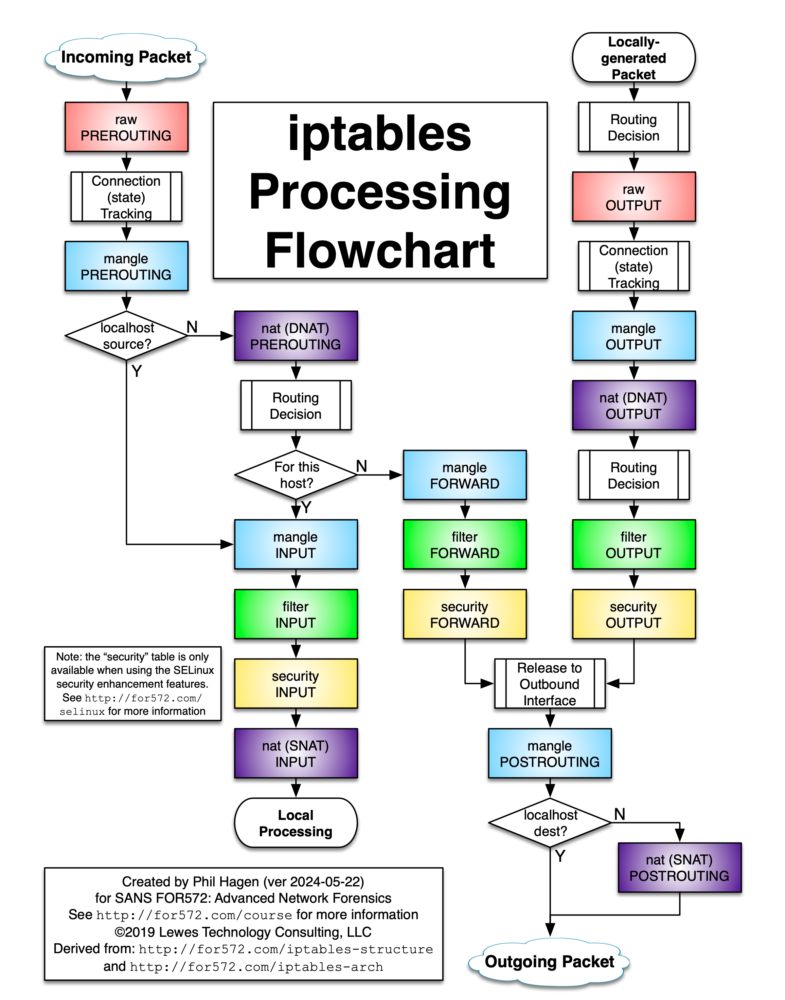

# Networking

Here are some basic networking facts that supports the understanding of kubernetes devops pipelines, and understand the networking aspect of VM configurations.

## Layers (OSI model)

```
Link Layer (MAC) -> Internet Layer (IP/ICMP)  -> Transport layer (TCP/UDP etc)
Low level                         ------>                           High level
```

##  IPv4 packet routing
A subnet are all IPs of the form:
    * `a.b.c.xxx`
        * subnet mask `255.255.255.0`
        * subnet represented by `a.b.c.0/24`
    * `a.b.xxx.xxx`
        * subnet mask `255.255.0.0`
        * subnet represented by `a.b.0.0/16`
    * `a.xxx.xxx.xxx`
        * subnet mask `255.0.0.0`
        * subnet represented by `a.0.0.0/8`

IP packets towards the same subnet are routed directly to the device with destination IP. Otherwise, it gets routed to the gateway, usually the first usable IP address in the subnet `a.b.c.1`, which is usually the router's IP, or the virtual IP belonging to the host's gateway for IP packet forwarding for VMs.

## iptables packet routing

Commands:
```
iptables-save
```

Note that one can create a systemctl service by creating an entry inside `/etc`, so the iptable rules are restored. The iptables rules come in order of the execution of the iptables command (if a command to create a rule was executed before the another command that creates another rule in the same table, the prior rule has higher precedence).

### iptables flowchart

Source: https://stuffphilwrites.com/fw-ids-iptables-flowchart-v2024-05-22/

### iptables explanation
In each coloured square, note that there is a (table, CHAIN) combination (e.g raw table, PREROUTING chain). Each packet goes through every part of the flowchart, and each (table, CHAIN) combination dictates whether the packet is allowed to pass (or transformed to perform masquerading for NAT and so on). 

For each packet, the rules get matched from top to bottom, and whenever a rule gets matched with ACCEPT, the packet stops processing in that (table, CHAIN) and gets to the next square in the flowchart. If a rule gets matched with DROP or REJECT, the packet gets discarded without going to the next square in the flowchart. If the current rule in the (table, CHAIN) list doesn't match, iptables tries to match the next rule in the sequential list. If no rules are matched, the default policy will be used, which also depends on configuration.

### UFW interaction with iptables
UFW interacts with iptables by default. Usually, UFW only interacts with the FILTER table (not 100% sure). When the systemctl job for restoring custom iptables configuration is scheduled before the systemctl UFW service (using dependencies), its possible to override UFW operations in the FILTER table (e.g force dropping of IP packet forwarding between two separate subnets).

## Network bridges
Network bridges are at the link layer of the OSI model. It is necessary to know a bit about bridges for managing libvirt virtual machines. In Ubuntu, one can configure virtual network bridges inside the `/etc/netplan` folder, where the YAML files are processed in alphanumeric order of precedence (its best to have a single YAML for clarity), where later files will override previous ones. 

The `ethernet` tag is for configuring the ethernet for the host/node to communicate with outside (or the physical router), and is usually of the form
```
  ethernets:
    eth1:
      dhcp4: true # router uses DHCP
      link-local: ['ipv4'] # only allow IPv4
      match:
        macaddress: "aa:bb:cc:dd:ee:ff" # actual physical MAC address of network interface card
      set-name: eth1
      gateway4: 192.168.0.1 # gateway of router
```

To attach virtual network bridges for NAT to allow VMs to access the outside internet, one has to create a virtual bridge, so libvirt can attach virtual networks to the bridge. This also isolates the VM's with the physical bridge of the host machine at the Link layer.

```
  bridges:
    VMBridge: # name of bridge
      addresses:
        - 192.168.100.1/24 # gateway address of host. Note that if host listens to 192.168.100.1, the VMs can access the services there
      interfaces: []
      optional: true
```

In the libvirt VM XML file, one can then use the interface tag to allow the VM to access the internet using NAT, so the virtual NIC of the VM is bound to the specified virtual bridge of the host.
```
    <interface type='bridge'>
      <mac address='aa:bb:cc:dd:ee:ff'/> <!-- Set a random MAC address for the VM, only has to be different from the virtual bridge of netplan  -->
      <source bridge='VMBridge'/> <!-- name of virtual bridge --->
      <model type='virtio'/>
    </interface>
```